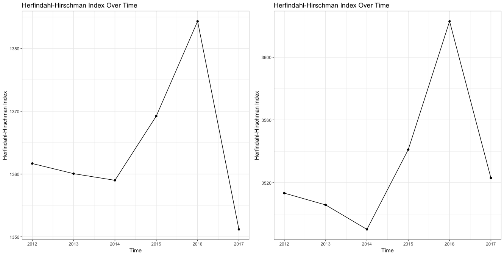
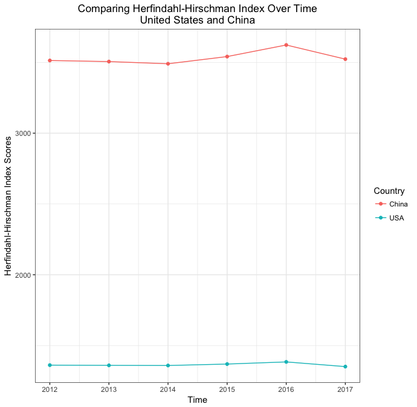

# Summary

Concentration and competition are key aspects of many fields, from economics and busieness to political and social sciences. One of the most common measures of concetration is the Herfindahl-Hirschman Index [@herfindahl:1950] [@hirschman:1945]. The measure, which is often used as a measure of competition among actors in a finite space, is calculated as the sum of squared shares of the market retained by individual firms or actors [@rhoades:1993]. A score of 0 means perfect competition, and a score of 10,000 means a perfect monopoly, where the market is dominated by a single firm or actor. Despite the Index's frequent use, though, to date there has been no `R` package solely dedicated to calculation and visualization of this common metric.

The R package [@team:2000] hhi is dedicated to filling this gap, by offering an intuitive, simple-to-use set of functions to calculate and visulalize Herfindahl-Hirschman Index scores. For calculation, users simply need to call the `hhi` command, and include the name of the data frame, followed by the name of the column vector corresponding with the market shares variable in quotation marks. Running this command will return the Herfindahl-Hirschman Index score for the given market. There are numerous defensive coding features in the latest (`1.1.0`) release of the package, such as a warning message when the shares do not sum too 100% (though the function still generates the score with whatever data is supplied), a stop error if the data frame object `x` is _not_ a data frame (e.g., a matrix), as well as a few others detailed in the `NEWS.md` file included with the package on CRAN. All of these features offer tips to guide the user through proper diagnosis of the issue in order to ameliorate the problem in service of the package's ultimate goal, which is a streamlined and intuitive calculation of such a widely used metric. Finally, the package also comes with a plotting function to allow for a quick look at the Herfindahl-Hirschman Index scores calculated using the `hhi` command. The function `plot_hhi` leverages `ggplot2` to offer clean visual output. As noted in the package documentation, though, the `plot_hhi` function is relatively inflexible and intended for quick visual inspection. It is recommended that for publication or professional applications, users produce plots manually to allow for greater flexibility. This tradeoff is demonstrated below in the brief exercise.

To see the `hhi` package in action, consider a brief tutorial using real market data on microwave company market shares in the United States and China [@euro]. The value of this exercise is twofold: first, to demonstrate use of the package with real economic data, and second, to demonstrate the value of the package in examining a substantive social science question on market competition between two large global producers (the U.S. and China).

```{r }

install.packages("hhi")
library(hhi)

# Next, read in the .csv data file, "microwaves.csv" (Source: © Euromonitor International)
microwaves <- read.csv(".../microwaves.csv") # Specify file path where .csv file is stored

# Next, store all HHI scores for each year in the data
# Note, for several years a warning message notes shares don't sum to 100 due to rounding
usa.12 <- hhi(usa, "ms.2012")<br/>
usa.13 <- hhi(usa, "ms.2013")<br/>
usa.14 <- hhi(usa, "ms.2014")<br/>
usa.15 <- hhi(usa, "ms.2015")<br/>
usa.16 <- hhi(usa, "ms.2016")<br/>
usa.17 <- hhi(usa, "ms.2017")<br/>

# Create a few objects to see fluctuation in the U.S. HHI from 2012-2017
usa.hhi <- rbind(usa.12, usa.13, usa.14, usa.15, usa.16, usa.17)
year <- c(2012, 2013, 2014, 2015, 2016, 2017)
usa.hhi.data <- data.frame(year, usa.hhi)
usa.plot <- plot_hhi(usa.hhi.data, "year", "usa.hhi")
usa.plot

# Next, explore and store China's HHI for the same years
china.12 <- hhi(china, "ms.2012")
china.13 <- hhi(china, "ms.2013")
china.14 <- hhi(china, "ms.2014")
china.15 <- hhi(china, "ms.2015")
china.16 <- hhi(china, "ms.2016")
china.17 <- hhi(china, "ms.2017")

china.hhi <- rbind(china.12, china.13, china.14, china.15, china.16, china.17)
year <- c(2012, 2013, 2014, 2015, 2016, 2017)
china.hhi.data <- data.frame(year, china.hhi)
china.plot <- plot_hhi(china.hhi.data, "year", "china.hhi")
china.plot

# Now view side-by-side plots of USA and China for Comparison
library(grid) # load for quick side by side view
vplayout <- function(x, y) {
  viewport(layout.pos.row = x, layout.pos.col = y)
}

grid.newpage()
pushViewport(viewport(layout = grid.layout(1, 2))) # 1 r, 2 c
print(usa.plot, vp = vplayout(1, 1))
print(china.plot, vp = vplayout(1, 2))

```

The above code produces the clear rendering of the hhi for microwave suppliers in the U.S. and China below. 



Yet, due to the inflexibility of the `plot_hhi` function discussed above, such a side by side rendering does not make a great deal of sense especially given the different Y-axes for each country, suggesting wide variance in market competition. Per the previous suggestion, users may want to manually overlay the hhi trends over time for each country in a single plot. To do so, consider the following code continuing with this example.

```{r }
# First, make a new combined dataset
year <- c(2012, 2013, 2014, 2015, 2016, 2017, 2012, 2013, 2014, 2015, 2016, 2017)
country <- c("USA", "USA","USA","USA","USA","USA","China","China","China","China","China","China")
usa.hhi <- t(t(usa.hhi.data[,2]))
china.hhi <- t(t(china.hhi.data[,2])) 
hhi <- rbind(usa.hhi, china.hhi) 
hhi.data <- data.frame(year, country, hhi) 

library(ggplot2) # load the ggplot2 library for manual use below

hhi.data$Country <- as.factor(hhi.data$country)

full.plot <- ggplot(hhi.data, aes(year, hhi, colour = Country)) +
  geom_point() +
  geom_line() +
  xlab("Time") +
  ylab("Herfindahl-Hirschman Index Scores") +
  ggtitle("Comparing HHI Over Time, United States and China") +
  theme_bw()
full.plot + theme(plot.title = element_text(hjust = 0.5))

```

This code produces the much nicer, more intuitive comparison across hhi scores for the U.S. and China, calculated using the `hhi` function. The figure is below. Indeed, the figure shows that the competitiveness of the U.S. market is more than twice that of China's microwave manufacturing market.



The `hhi` package can be downloaded and installed either directly from CRAN or the source code may be accessed freely at the corresponding GitHub repository along with all package documentation and an issue tracker.

# Acknowledgements

I thank Josh Grode for some valuable defensive code suggestions, many of which were included in the most recent release. I also thank Thomas Leeper and Chris Skovron for the excellent comments, feedback, and review.  

# References
